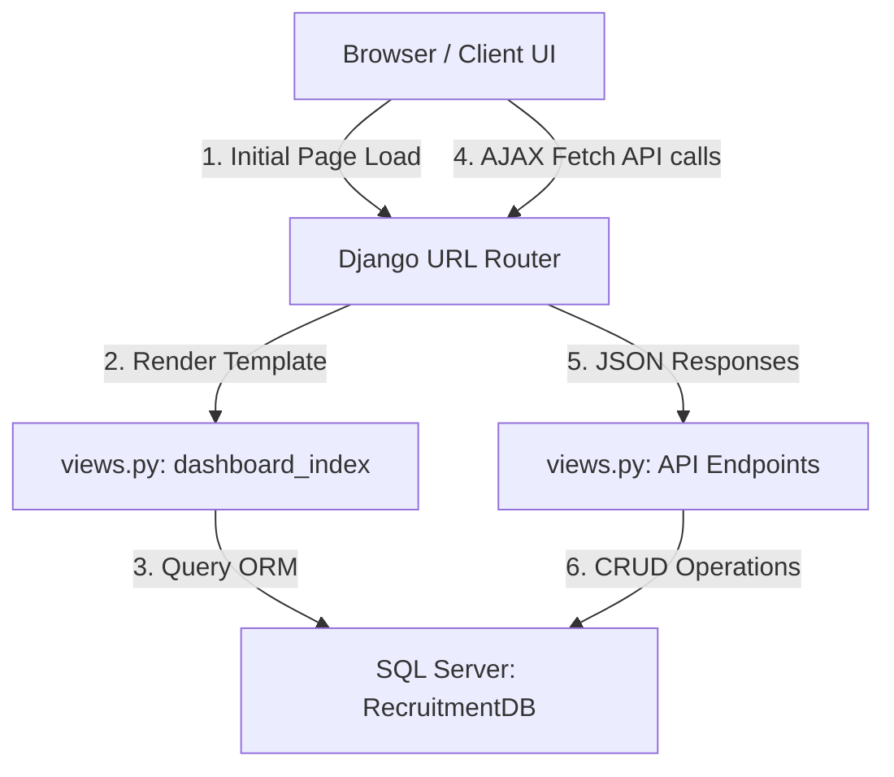

# RecruitDB: Recruitment Management System

This document outlines the architecture and implementation details of the **RecruitDB** recruitment management system. 

---

## 1. High-Level Architecture
The system is built as a hybrid Single Page Application (SPA) using:
* **Backend:** **Django** (Python) acting as a REST API and template server.
* **Database:** **Microsoft SQL Server (MS SQL)** as the persistent storage, integrated with Django via pyodbc/ODBC Driver 18.
* **Frontend:** A modern, responsive interface built with semantic **HTML5**, custom **Vanilla CSS** (for styling/animations), and **Vanilla JavaScript** (for asynchronous operations and dynamic DOM updates).

---

## 2. Backend Implementation (Django & SQL Server)

### Database Integration (`backend/recruitmentproject/settings.py`)
* Configured database settings to connect to a local **Microsoft SQL Server** instance named `RecruitmentDB` on port `1433`.
* Uses `Encrypt=yes` and `TrustServerCertificate=yes` to support secure server connection settings.
* Installed and configured `corsheaders` to permit cross-origin requests.

### Data Models (`backend/recruitmentapp/models.py`)
* Django models reflect an existing SQL Server schema (using `managed = False` so Django does not override database constraints during migrations).
* Key entities include:
    * **Users:** System accounts with fields like `full_name`, `email`, `password`, and `user_type` (Recruiter, Manager, Applicant).
    * **JobPostings:** Postings containing `title`, `description`, `posted_date`, `closing_date`, and linked to a **Department**.
    * **Departments:** Corporate departments (e.g. IT, HR) to which jobs are assigned.
    * *Other entities:* `Applicants`, `Applications`, `Interviews`, `Qualifications`, `Skills`, and assignment helper tables.

### REST API & Controllers (`backend/recruitmentapp/views.py`)
Implemented API endpoints that process client requests and return JSON responses:
* **Users CRUD Operations:**
    * `api_user_list`: Returns all users.
    * `api_user_create`: Performs validation, checks if the email is already in use, determines the next incremented ID, and saves the new user profile.
    * `api_user_update`: Modifies user details, dynamically updating passwords if a new one is provided.
    * `api_user_delete`: Deletes a user profile.
* **Job Postings CRUD Operations:**
    * `api_job_list`, `api_job_create`, `api_job_update`, `api_job_delete` mapping job properties to the database.

---

## 3. Frontend Implementation (UI/UX & Client Logic)

### Modern Styling (`backend/recruitmentapp/static/recruitmentapp/style.css`)
* **Design Tokens:** Created a responsive design using CSS variables (`:root`) with a soft light slate theme (`hsl(210, 40%, 96%)` base, white cards, indigo primary accents, and emerald/rose success/danger indicators).
* **Typography:** Imported the **Outfit** Google Font for readable headers and body text.
* **Soft Elevation & Badges:** Used soft, modern box-shadows, clean borders, and distinct colored badges for roles (e.g., green for applicant, yellow for manager, purple for recruiter).

### Interactive JavaScript (`backend/recruitmentapp/static/recruitmentapp/app.js`)
* **Tab Routing:** Enables switching between the **Users Directory** and **Job Vacancies** views smoothly in the browser without reloading the page.
* **Modal Management:** Opens overlay modals in either "Create" or "Edit" modes. When editing, JavaScript pre-fills inputs from the current row's data and sets password inputs to be optional.
* **Asynchronous Fetch (AJAX):** Handles form submission and delete operations by sending `POST`, `PUT`, or `DELETE` requests containing JSON payloads. When successful, the script updates the HTML table dynamically.
* **Client-side Search Filters:** Instantly filters table rows as the user types in the search bar.
* **Toast System:** Generates slide-in success/error toast alerts at the bottom right that fade out after 4 seconds to give users feedback on actions (e.g., "User profile updated successfully!").
